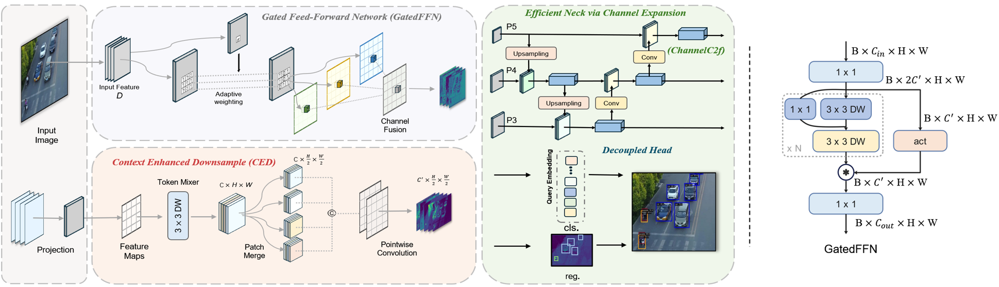
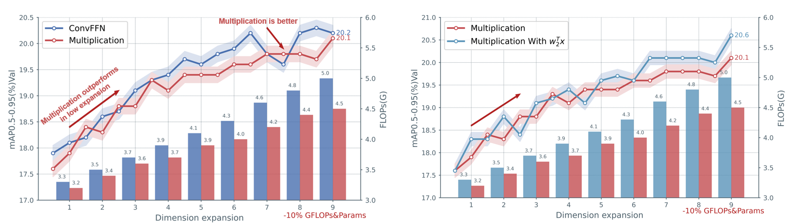

# RemDet

Official PyTorch implementation of "RemDet: Rethinking Efficient Model Design for UAV Object Detection" [AAAI 2025]

<details>
  <summary>
  <font size="+1">Abstract</font>
  </summary>
Object detection in Unmanned Aerial Vehicle (UAV) images has emerged as a focal area of research, which presents two significant challenges: i) objects are typically small and dense within vast images; ii) computational resource constraints render most models unsuitable for real-time deployment. Current real-time object detectors are not optimized for UAV images, and complex methods designed for small object detection often lack real-time capabilities. To address these challenges, we propose a novel detector, RemDet (Reparameter efficient multiplication Detector). Our contributions are as follows: 1) Rethinking the challenges of existing detectors for small and dense UAV images, and proposing information loss as a design guideline for efficient models. 2) We introduce the ChannelC2f module to enhance small object detection performance, demonstrating that high-dimensional representations can effectively mitigate information loss. 3) We design the GatedFFN module to provide not only strong performance but also low latency, effectively addressing the challenges of real-time detection. Our research reveals that GatedFFN, through the use of multiplication, is more cost-effective than feed-forward networks for high-dimensional representation. 4) We propose the CED module, which combines the advantages of ViT and CNN downsampling to effectively reduce information loss. It specifically enhances context information for small and dense objects. Extensive experiments on large UAV datasets, Visdrone and UAVDT, validate the real-time efficiency and superior performance of our methods. On the challenging UAV dataset VisDrone, our methods not only provided state-of-the-art results, improving detection by more than 3.4, but also achieve 110 FPS on a single 4090.
</details>

## Introduction
In this paper, we propose a simple yet efficient model.

The overview of the proposed RemDet.
<div align="center">
  
</div>

Comparison of the core innovations of the proposed RemDet:


<div align="center">

  

</div>


## Coming Soon

We will release of pretrained model weights.


## Main results

## Object Detection Performance for [VisDrone2019](https://github.com/VisDrone/VisDrone-Dataset):
|     Model      |  AP  | AP<sub>50</sub> | AP<sub>75</sub> | AP<sub>S</sub> | AP<sub>M</sub> | AP<sub>L</sub> | #Params | FLOPs |                         Log                         |
|:--------------:|:----:|:---------------:|:---------------:|:--------------:|:--------------:|:--------------:|:-------:|:-----:|:---------------------------------------------------:|
|  RemDet-Tiny   | 21.8 |      37.1       |      21.9       |      12.7      |      33.0      |      44.5      |  3.2M   | 4.6G  |  [log](resources/remdet_tiny/20240724_133030.log)   |
|    RemDet-S    | 24.7 |      41.5       |      25.0       |      15.4      |      36.7      |      47.0      |  11.9M  | 16.0G |    [log](resources/remdet_s/20240724_110347.log)    |
|    RemDet-M    | 27.3 |      44.7       |      28.2       |      17.3      |      40.5      |      57.8      |  23.3M  | 34.4G |    [log](resources/remdet_m/20240724_083541.log)    |
|    RemDet-L    | 29.3 |      47.4       |      30.3       |      18.7      |      43.4      |      55.8      |  35.3M  | 66.7G |    [log](resources/remdet_l/20240724_055016.log)    |
|    RemDet-X    | 29.9 |      48.3       |      31.0       |      19.5      |      44.1      |      58.6      |  74.1M  | 112G  |   [log](resources/remdet_x/20240728_082805.log)     |

## Object Detection Performance for [COCO2017](https://cocodataset.org):
|    Model    |  AP  | AP<sub>50</sub> | AP<sub>75</sub> | AP<sub>S</sub> | AP<sub>M</sub> | AP<sub>L</sub> |                          Log                          |
|:-----------:|:----:|:---------------:|:---------------:|:--------------:|:--------------:|:--------------:|:-----------------------------------------------------:|
| RemDet-Tiny | 39.5 |      55.8       |      42.8       |      21.0      |      43.9      |      54.0      | [log](resources/mscoco/remdet_tiny_coco.log) |
|  RemDet-S   | 45.5 |      62.8       |      49.6       |      27.8      |      50.5      |      60.0      | [log](resources/mscoco/remdet_s_coco.log) |
|  RemDet-M   | 49.8 |      66.9       |      54.0       |      32.8      |      54.7      |      65.0      | [log](resources/mscoco/remdet_m_coco.log) |


------
## Object Detection
### Environments
```shell
conda create -n remdet -y python=3.11
pip3 install -y pytorch==2.2.0 torchvision torchaudio --index-url https://download.pytorch.org/whl/cu121  # cu121
pip install -r ./requirements.txt &&
pip install albumentations==1.4.4 timm  &&
pip install -U openmim &&
mim install mmengine &&
mim install mmcv==2.2.0 &&
pip install -v -e .
```
  
### Prepare VisDrone2019 Dataset
Download and extract [VisDrone2019](https://github.com/VisDrone/VisDrone-Dataset) dataset in the following directory structure:

```
├── VisDrone2019-DET-COCO
    ├── images
        ├── train
            ├── 0000002_00005_d_0000014.jpg
            ├── ...
        ├── val
            ├── 0000001_02999_d_0000005.jpg
            ├── ...
    ├── annotations
        ├── VisDrone2019-DET_train_coco.json
        ├── VisDrone2019-DET_val_coco.json

```

## Train
Train with 8 GPUs:

```
bash tools/dist_train.sh config_remdet/remdet/remdet_x-300e_coco.py 8 --amp --work-dir work_dir/remdet_x
```


## Acknowledgements
We thank but not limited to following repositories for providing assistance for our research:

[//]: # (- [TIMM]&#40;https://github.com/rwightman/pytorch-image-models&#41;)
- [MMDetection](https://github.com/open-mmlab/mmdetection)
- [MMYOLO](https://github.com/open-mmlab/mmyolo)